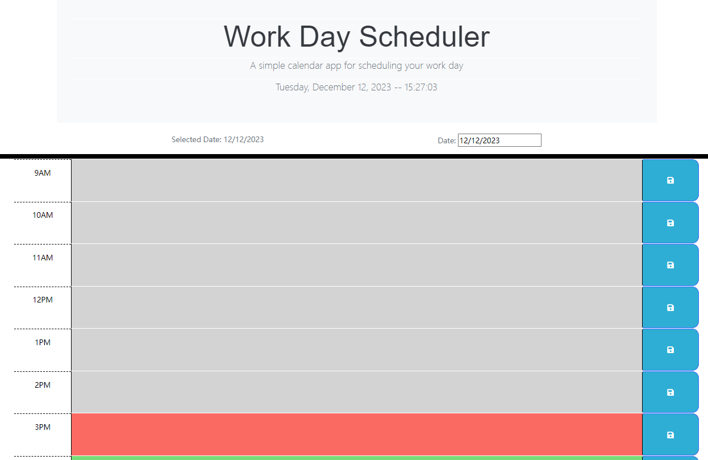

<a id="readme-top"></a>


<div align="center">
  <a href="https://github.com/Jason897571/raccoon-time-manager">
    
  </a>

  <h3 align="center">Raccoon Time Manager</h3>

  <p align="center">
    This is an efficient time manangement tool you may like! <br />You wouls arrange your time in a more efficient way!
    <br />
    <a href="https://github.com/Jason897571/raccoon-time-manager"><strong>Click here for Github Repo  »</strong></a>
    <br />
    <br />
    <a href="https://jason897571.github.io/raccoon-time-manager/">View Demo</a>
    ·
    <a href="https://github.com/Jason897571/raccoon-time-manager/issues">Report Bug</a>
    ·
    <a href="https://github.com/Jason897571/raccoon-time-manager/issues">Request Feature</a>
  </p>
</div>

<!-- TABLE OF CONTENTS -->
<details>
  <summary>Navigation of Contents</summary>
  <ol>
    <li>
      <a href="#about-the-project">About The Project</a>
      <ul>
        <li><a href="#built-with">Built With</a></li>
      </ul>
    </li>
    <li>
      <a href="#getting-started">Getting Started</a>
      <ul>
        <li><a href="#prerequisites">Prerequisites</a></li>
        <li><a href="#installation">Installation</a></li>
      </ul>
    </li>
    <li><a href="#usage">Usage</a></li>
    <li><a href="#contact">Contact</a></li>
    <li><a href="#future_additions">Future Additions</a></li>
    <li><a href="#reference">Reference</a></li>
  </ol>
</details>

<a id="#about-the-project"></a>
## About The Project

<p><strong>Start Page</strong></p>



<br />

This is a time manager that allows you to track your time spent on projects and tasks.


<a id="#built-with"></a>
## Built with
This Quiz is built with HTML, CSS and Javascript.
* [][HTML-url]
* [][CSS-url]
* [][Javascript-url]
* [][BootStrap-url]
* [][jQuery-url]

<p align="right">(<a href="#readme-top">back to top</a>)</p>

<a id="getting_started"></a>
## Getting Started

This is an example of how you may give instructions on setting up your project locally.
To get a local copy up and running follow these simple example steps.

<a id="prerequisities"></a>
### Prerequisites

You should have your shell ready for downloading this project. We use gitbash as an example in this project

<a id="installation"></a>
### Installation
1. Get a free API Key at [github](https://github.com/Jason897571/raccoon-time-manager#built-with)
2. Clone the repo
   ```sh
   git clone https://github.com/Jason897571/raccoon-time-manager.git
   ```
3. Open the project using vs code and run it in browser


<p align="right">(<a href="#readme-top">back to top</a>)</p>


<a id="usage"></a>
## Usage

when you open the project in your browser, you will see the following page.


When the time is up or your complete the quiz, it will bring you to the initial page where you can input your inital and store your scores.

<p><strong>Result Page</strong></p>


After you submit your initial and score, you will see the final rank board. By clicking the "Go Back" button , you can go back to the start page. By clicking the "Clear high scores" button, you can clear all scores and initials.


<p><strong>Rank Page </strong></p> 


For more details, please refer to the [Documentation](https://github.com/Jason897571/raccoon-time-manager)

<p align="right">(<a href="#readme-top">back to top</a>)</p>


<a id="future_additions"></a>
## Future Additions
* Different question types can be added
* A difficulty Options panel can be added to start page
* A Panel to show historical correct and incorrect questions can be added
* The ranking system can be added to have the highest score in the first place in the rank page.

<p align="right">(<a href="#readme-top">back to top</a>)</p>


<a id="contact"></a>
## Contact

Jason Gu - [Email](king.gs1314@outlook.com) - king.gs1314@outlook.com

Project Link: [https://github.com/Jason897571/raccoon-time-manager](https://github.com/Jason897571/raccoon-time-manager)

<p align="right">(<a href="#readme-top">back to top</a>)</p>

<a id="reference"></a>
## Reference
* Xpert Assistant/ChatGPT
* https://dev.to/envoy_/150-badges-for-github-pnk#games
* https://github.com/othneildrew/Best-README-Template


<p align="right">(<a href="#readme-top">back to top</a>)</p>

<!-- MARKDOWN LINKS & IMAGES -->
<!-- https://www.markdownguide.org/basic-syntax/#reference-style-links -->
[css-url]:https://img.shields.io/badge/CSS-239120?&style=for-the-badge&logo=css3&logoColor=white
[HTML-url]:https://img.shields.io/badge/HTML-239120?style=for-the-badge&logo=html5&logoColor=white
[Javascript-url]:https://img.shields.io/badge/JavaScript-F7DF1E?style=for-the-badge&logo=javascript&logoColor=black
[BootStrap-url]:https://img.shields.io/badge/Bootstrap-563D7C?style=for-the-badge&logo=bootstrap&logoColor=white
[jQuery-url]:https://img.shields.io/badge/jQuery-0769AD?style=for-the-badge&logo=jquery&logoColor=white